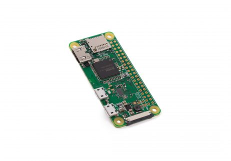
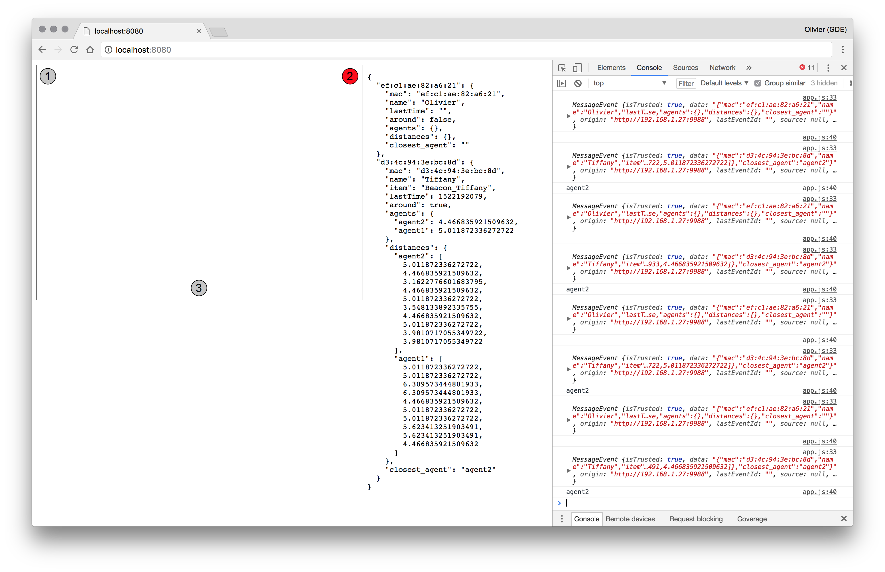

## Beacon Presence Tracker

Simple tracker to track presence with beacons.

- **Agent** : Each agent send a message to a mqtt server when they detect a Beacon with informations (rssi, mac address, etc)
- **Server** : The server listen to the agents on the mqtt tracker. Write every second on an event stream on /events

```
event: message
data: {"mac":"ef:c1:ae:82:a6:21","name":"Olivier","lastTime":1522191111,"around":true,"agents":{"agent1":4.223953813522302,"agent2":5.660722890537327},"distances":{"agent1":[1.9952623149688795,10,...],"agent2":[2.2387211385683394,14.12537544622754,...]},"closest_agent":"agent1"}
```

- mac: The mac address of the beacon detected
- name : The name of the user associated to the beacon
- lastTime: The last time the beacon has been detected
- around: After 60sec, the beacon is declared "out of range"
- agents: List of all agents with the 10 last distance to the beacon
- closest_agent: The closest agent (calculated by taking the median of the last 10 distances to each agent)

The agents run on [Raspberry Pi Zero W](https://www.raspberrypi.org/products/raspberry-pi-zero-w/) which is very cheap and small for such usecase.


The mqtt server and the server.js run on a Raspberry Pi 3B

A WIP web-client allows to see which agent is the closest to the beacon.
Comming soon : Triangulation when I receive my 3rd Pi Zero W to localise the beacon in on a 2D map :)




